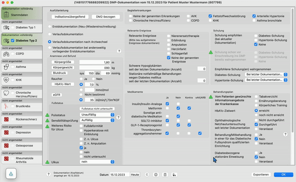

# FAQ

## TL;DR;
**Was ist es?** Eine schnelle AMBOSS-Suchbox auf dem Desktop.  
**Wie funktioniert's?** Hotkeys nutzen (CMD + J für Mac, Ctrl + J für Windows) für direkten Zugriff.  
**Features:** Automatische Suchvorschläge, schnelle Artikel, ggf. bald Checklisten und Laborwerte auflisten  
**Download & Installation:** Einfach, mit Autostart-Option. Verfügbar auf [GitHub](https://github.com/amboss-mededu/ambulaunch-beta-releases).  
**Benutzung:** Einloggen einmalig erforderlich, bleibt lange aktiv. Icons im Blick behalten für schnellen Zugriff.  
**Bugs:** Kleine Ruckler, Probleme mit externen Monitoren.

## Willkommen bei Ambulaunch!
Ein intuitiver Launcher für die AMBOSS-Plattform, der den Zugriff auf medizinische Bildungsressourcen vereinfacht.

## Hauptfunktionen:
- **Sofortzugriff:** Mit Hotkey (CMD + J für Mac, Ctrl + J für Windows) direkt zur Suchbox.
- **Effiziente Suche:** Automatische Vorschläge und schnelle Antworten speziell für medizinische Fachgebiete.

### Extras:
- Individuelle Inhaltsvorschläge und schnelle Hilfefunktionen, wie z.B. das Anzeigen von Laborwerten oder Checklisten.

## Erste Schritte

## Download
Die Download-Dateien sind [hier](https://github.com/amboss-mededu/ambulaunch-beta-releases) öffentlich zugänglich. Die jeweils aktuellste Version findet sich im Abschnitt Download.

## Installation
Installation wie von anderen Anwendungen bekannt. **Ambulaunch** wird außerdem in den Autostart installiert, sodass es bei Neustarts automatisch startet.  
Wenn das nicht erwünscht ist:
- [Anleitung für Windows](https://support.microsoft.com/de-de/windows/festlegen-dass-apps-automatisch-ausgef%C3%BChrt-werden-wenn-sie-ihr-ger%C3%A4t-starten-a5b64b3e-4483-4dad-abc7-027a863e1c2e#)
- [Anleitung für Mac](https://support.apple.com/de-de/guide/mac-help/mh21210/mac)

## Einrichtung
### Sichtbarkeit
Wir empfehlen, die Desktop-Suche so einzustellen, dass zu jeder Zeit ein kleines AMBOSS-Logo zu sehen ist. Dazu wie folgt vorgehen:
- **Bei Mac:** Rechtsklick auf das AMBOSS-Icon in der Menüleiste oben rechts im Bild
- **Bei Windows:** Rechtsklick auf das AMBOSS-Icon in der Taskleiste/Benachrichtigungsbereich, i.d.R. unten rechts im Bild. Wenn nicht zu sehen, Klick auf den Pfeil um “Weitere anzuzeigen”

Danach, falls nicht schon aktiv, das Item “Immer anzeigen” aktivieren. Dadurch erscheint auf dem Bildschirm ein AMBOSS-Logo, das sich verschieben und anklicken lässt.

## Benutzen
Die Suche lässt sich nun über Strg/Cmd + J oder über Klick auf das Amboss-Logo aufrufen. Suchbegriff eingeben und über Pfeiltasten, Klick oder Enter die Suche wie im Webbrowser ausführen. Die Suchbox kann über einen Klick an anderer Stelle wieder minimiert werden und über den Hotkey oder Klick aufs Icon eine erneute Suche gestartet werden.

## Einloggen
**Ambulaunch** ruft einen eigenen Mini-Browser auf. Dadurch wird beim ersten(!) Aufrufen zum Einloggen aufgerufen. Solange der Nutzer nicht abgemeldet wird, bleibt die Sitzung lange aktiv, ohne dass ein erneutes Anmelden erforderlich ist.

## Bekannte Bugs
- Probleme bei Verwendung mit wechselnden externen Monitoren
