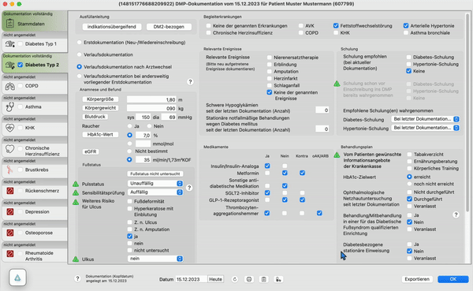

# FAQ

## TL;DR
**Was ist es?** Ein Desktop-Launcher für die AMBOSS-Plattform mit Such-Hotkey.  
**Wie funktioniert's?** Hotkey nutzen (`Cmd + J` für macOS, `Strg + J` für Windows) für direkten Zugriff — frei umbelegbar in den Einstellungen.  
**Features:** Suche, KI-Modus (Ask), schwebendes Logo, Deutsch/Englisch, automatische Updates.  
**Download & Installation:** Einfach, mit Autostart-Option. Verfügbar im [Releases-Bereich auf GitHub](https://github.com/amboss-mededu/ambulaunch-beta-releases/releases/latest).  
**Benutzung:** Einloggen einmalig erforderlich, bleibt lange aktiv.

## Willkommen bei Ambulaunch!
Ein intuitiver Launcher für die AMBOSS-Plattform, der den Zugriff auf medizinische Inhalte vereinfacht.

## Hauptfunktionen
- **Sofortzugriff:** Mit Hotkey (`Cmd + J` für macOS, `Strg + J` für Windows) direkt zur Suchbox — frei umbelegbar.
- **Effiziente Suche:** Automatische Vorschläge und schnelle Antworten, speziell für medizinische Fachgebiete.
- **KI-Modus (Ask):** Eine medizinische Frage stellen und eine kuratierte, kontextuelle Antwort erhalten.

## Erste Schritte

## Download
Die Download-Dateien sind im [Releases-Bereich](https://github.com/amboss-mededu/ambulaunch-beta-releases/releases/latest) öffentlich zugänglich. Dort jeweils die zur Plattform passende Datei auswählen.

## Installation
Installation wie von anderen Anwendungen bekannt. **Ambulaunch** wird außerdem in den Autostart aufgenommen, sodass es bei jedem Login automatisch bereitsteht.

Falls nicht gewünscht, lässt sich der Autostart abschalten — entweder direkt in den Ambulaunch-Einstellungen (Tray-Icon → Einstellungen → Allgemein → **Beim Anmelden starten**) oder über die Systemeinstellungen:
- [Anleitung für Windows](https://support.microsoft.com/de-de/windows/festlegen-dass-apps-automatisch-ausgef%C3%BChrt-werden-wenn-sie-ihr-ger%C3%A4t-starten-a5b64b3e-4483-4dad-abc7-027a863e1c2e)
- [Anleitung für Mac](https://support.apple.com/de-de/guide/mac-help/mh21210/mac)

## Hotkey ändern
Standardmäßig öffnet sich Ambulaunch mit `Cmd + J` (macOS) bzw. `Strg + J` (Windows). Eine andere Tastenkombination lässt sich festlegen über Tray-Icon → **Tastenkürzel** → **Tastenkürzel ändern** oder in den Einstellungen unter **Allgemein → Tastenkürzel**.

## Schwebendes Logo
Wir empfehlen, das schwebende AMBOSS-Logo auf dem Desktop zu aktivieren, damit Ambulaunch auch ohne Hotkey jederzeit erreichbar bleibt. Aktivierung über Tray-Icon → **Schwebendes Logo anzeigen** oder Einstellungen → Allgemein. Das Logo lässt sich frei platzieren und merkt sich seine Position über Neustarts hinweg.

## Sprache umstellen
Ambulaunch unterstützt Deutsch und Englisch. Umschaltung über Tray-Icon → **Sprache** oder Einstellungen → Allgemein → **Sprache**. Ein Neustart der App schließt die Umstellung ab.

## Benutzen
Die Suche lässt sich nun über den Hotkey oder per Klick auf das schwebende Logo aufrufen. Suchbegriff eingeben und über Pfeiltasten, Klick oder Enter die Suche ausführen, wie aus dem Webbrowser bekannt. Die Suchbox kann durch Klick an anderer Stelle minimiert und über den Hotkey jederzeit wieder aufgerufen werden.

## Einloggen
**Ambulaunch** ruft beim ersten Start einen integrierten Mini-Browser zur AMBOSS-Anmeldung auf. Solange der Nutzer nicht abgemeldet wird, bleibt die Sitzung anschließend langfristig aktiv, ohne dass eine erneute Anmeldung erforderlich ist.

## Updates
Ambulaunch aktualisiert sich automatisch im Hintergrund. Sobald eine neue Version installiert ist, erscheint ein Dialog für den Neustart.

Wer Updates frühzeitig testen möchte, kann unter **Einstellungen → Updates → Pre-Release-Versionen** den Pre-Release-Kanal aktivieren.

## KI-Modus (Ask)
Im Eingabefenster oben zwischen **Suche** und **KI-Modus** wechseln. Im KI-Modus eine medizinische Frage formulieren — Ambulaunch liefert eine kontextuelle Antwort auf Basis kuratierter AMBOSS-Inhalte.

## Datenschutz
Suchanfragen werden zur Verarbeitung an die AMBOSS-Plattform übermittelt — wie auch beim normalen Browserzugriff. Darüber hinaus sendet die App eine anonyme Geräte-ID zur Stabilitäts- und Nutzungsmessung. Diese ID lässt sich keiner Person zuordnen.

## Ambulaunch Pro
Für erweiterte Funktionen — Spracheingabe, lokale KI-Modelle, OCR — gibt es **Ambulaunch Pro** für Kliniken und Praxen. Anfragen an **hallo@amboss.com**.

## Bekannte Einschränkungen und Probleme melden
Bekannte Bugs und Limitationen werden in den jeweiligen [Release Notes](https://github.com/amboss-mededu/ambulaunch-beta-releases/releases) dokumentiert. Fehler oder Verbesserungswünsche bitte per E-Mail an **hallo@amboss.com**.
